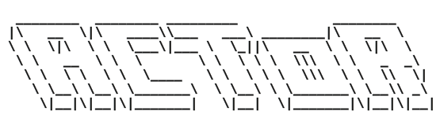
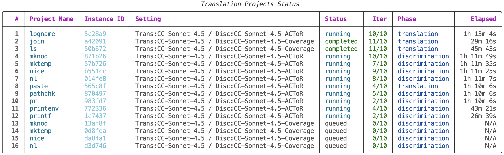
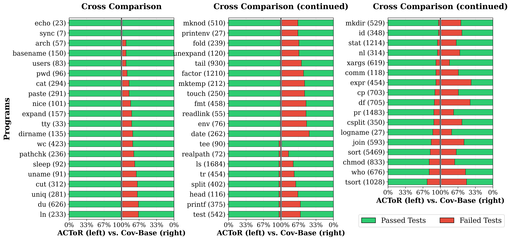
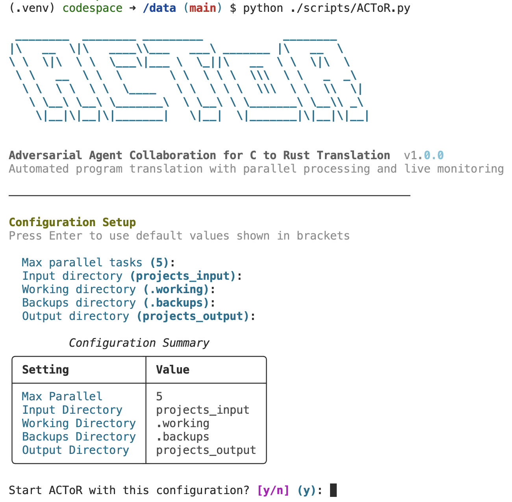
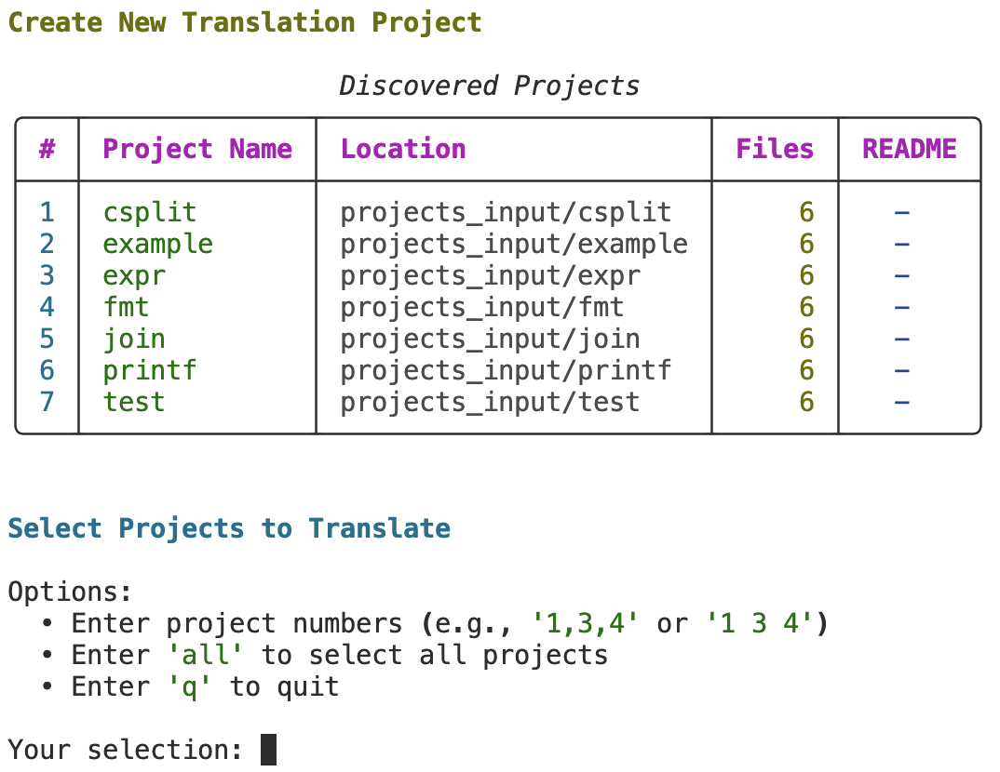
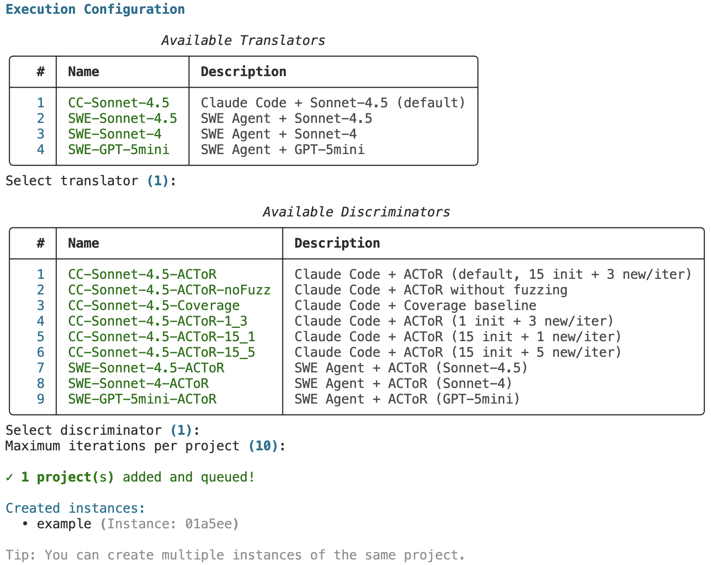
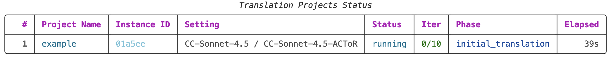

# ACToR: Adversarial Agent Collaboration for C to Rust Translation

<div align="center">
  <picture>
    <source media="(prefers-color-scheme: dark)" srcset="docs/images/actor_logo_dark.svg">
    
  </picture>
</div>

<br/>

<p align="center">
  📖 Paper: 
  <a href="https://arxiv.org/abs/2510.03879v2">
    Adversarial Agent Collaboration for C to Rust Translation
  </a>
</p>

🚀 ACToR is a powerful, automated, and simple program translation framework with **parallel processing** and **live monitoring** for managing long-running translation tasks.

<div align="center">
  
</div>


🚀 ACToR automatically translated 57 BSDCore Utilities to **safe** Rust with **95%+** test pass rate on discrimitive test cases. There is **no** human intervention in the translation procedure.



## How Does ACToR Work?

Inspired by GANs, ACToR pits a generator agent against a discriminator agent, which collaborate to iteratively generate a Rust translation. On each iteration, the translator agent synthesizes and refines a Rust translation to pass an existing suite of tests, and then the discriminator agent finds new failing tests.

As the iteration progresses, it becomes increasingly challenging for the discriminator agent to identify differences solely by examining the source code or conducting careful manual testing. To increase the limit, we design a simple agent-friendly fuzzing script to accelerate the mismatch discovery.

In the evaluation, we show the advantage of this adversarial design: ACToR largely improves the translation correctness compared with the coverage baseline. The fuzzing script further extends ACToR's ability for discovering translation mismatches.

For more details, please check our [paper](https://arxiv.org/abs/2510.03879). A demo video showing the working procedure of ACToR system: [ACToR](docs/images/ACT.mp4)
                                                      

## Quick Start with Your First Translation Task

### Quick Install

ACToR uses coding agent for translation task. Please run ACToR in a Docker container to ensure no destruction to the host machine.

```bash
# Build Docker image
cd __utils/docker
docker build -t actor-sandbox -f ./devuniv.Dockerfile .

# Start and Enter the Container 
./start.sh && ./shell.sh

# Setup inside Container (Must Rerun if Restart the Container)
cd /data/__utils/docker/inside/ && ./after_start.sh

# Activate venv and Verify installation
cd /data/ && source ./__utils/.venv/bin/activate && python ./scripts/ACToR.py --help
```

Agent calls relies on Claude Code account or API key. Please set API/Claude account properly before starting any translation task.

```bash
# Option 1: If use Claude Code (interactive login)
claude login

# Option 2: If use SWE agent
echo "your-anthropic-api-key" > /data/./__secret__/claude.key
```

📖 **For detailed installation instructions, see [INSTALLATION.md](docs/INSTALLATION.md)**


<!-- ## Basic Usage -->

### Launch ACToR Server
The ACToR server should be running during the whole translation process. **We recommand you to run ACToR in a tmux session**. During the translation process, you should not stop/quit the main ACToR server in most cases.

Each time you start ACToR, you need to set the following configurations, including the projects input directory, maximum number of parallel tasks, etc.


<div align="left">
  
</div>

</br>

In this example, we use the default configurations. After confirm the parameters, you will see the following menu. Note that this only means the basic ACToR server is started. There is no translation task running.


<div align="left">
  
</div>

</br>

(Optional) To avoid setting the parameters each time, you can create a config file to carry the parameters, then start ACToR with `-c`:

```bash
python ./scripts/actor.py -c ./scripts/default_config.json
```

### Prepare Input

Now, let's prepare an example C project. The example project contains a single C file (`example.c`) with trivial functionality. We prepared 15 simple seed tests in `tests00.jsonl`.

```
projects_input/
├── example/                        # Project name
│   ├── example.c                   # Source C code
│   ├── Makefile                    # Makefile
│   ├── tests00.jsonl               # Initial seed tests 
│   ├── norm_rules.jsonl            # Normalization rules
│   ├── testcmp.sh                  # Test driver script
│   └── fuzzer_template.py          # Common fuzzer template
└── ...                             # More projects
```

📖 **For detailed documentation about file struture and test case format, see [FILE_STRUCTURE.md](docs/FILE_STRUCTURE.md)**


### Create the Translation Task

We will create the translation task for this example project. Type `add` in the ACToR console to list all the projects found in the `projects_input` directory you specified in the beginning.

<div align="left">
  
</div>

</br>

We select `example` project. We then need to pick the translator and discriminator, and set the maximum iteration. We will explain all the available translators/discriminators in [MODULES](docs/MODULES.md). In this example, let's use the default setting (i.e., ACToR with fuzzing script). After setting all the parameters for the task, you can see the following message.

<div align="left">
  
</div>

</br>

🎉 Good job! This indicates you have successfully created the translation task! If everything (API keys) is configured correctly, you can see it in the dashboard (type `Enter` to refresh the status table):

<div align="center">
  
</div>
</br>

Each task has its own instance ID (which is `01a5ee` for this example). This means that **one input project can have different task instances**. This provides the support for running the same project with different settings/reruning same settings multiple times.

To view the translation process and result, you can check `./.working/example/sandbox/` directory (assume `./.working` is the selected working directory). After each iteration, the working folder will be copied to and archived in `./.backups/example/iteration_x/`. After all the iterations completed, the result will be copied one more time into `./projects_output/example` directory.

In most cases, after starting the task, nothing else needs from you during the translation process. ACToR system will automatically run it until the maximum iteration is reached.


\**When use the default setting (default translator/discriminator), it takes about $20-30 USD to finish 10 iterations on a project with 500 lines of code. The time cost is about 2-3 hours.*


📖 **To know the advanced control of translation process, see [COMMANDS.md](docs/COMMANDS.md)**


## Reproduction on Our Benchmarks

Please check [REPRODUCTION.md](docs/REPRODUCTION.md) for detailed instructions on how to reproduce our benchmark results.


## Extension to ACToR

If you’re interested in ACToR or want to integrate your own translator or discriminator, feel free to explore the [MODULES](docs/MODULES.md) guide.

🚧 The document and the overall architecture are still under active development. We are working toward designs that make ACToR easier for new users to adopt while supporting customized pipelines.

If you have suggestions or encounter any issues in the current implementation, please reach out—we welcome all feedback.

## Citation

If you find ACToR useful in your research or work, please cite our paper:

```bibtex
@misc{li2025adversarialagentcollaborationc,
      title={Adversarial Agent Collaboration for C to Rust Translation}, 
      author={Tianyu Li and Ruishi Li and Bo Wang and Brandon Paulsen and Umang Mathur and Prateek Saxena},
      year={2025},
      eprint={2510.03879},
      archivePrefix={arXiv},
      primaryClass={cs.SE},
      url={https://arxiv.org/abs/2510.03879}, 
}
```

## License

This project is licensed under the MIT License - see the [LICENSE](LICENSE) file for details.

### Acknowledgments

- **[Mini-SWE-Agent](https://github.com/SWE-agent/Mini-SWE-Agent)** - SWE agent implementation (MIT License, Copyright © 2025 Kilian A. Lieret and Carlos E. Jimenez)
- **BSD Core Utilities** - Benchmark programs used for evaluation (BSD License)

