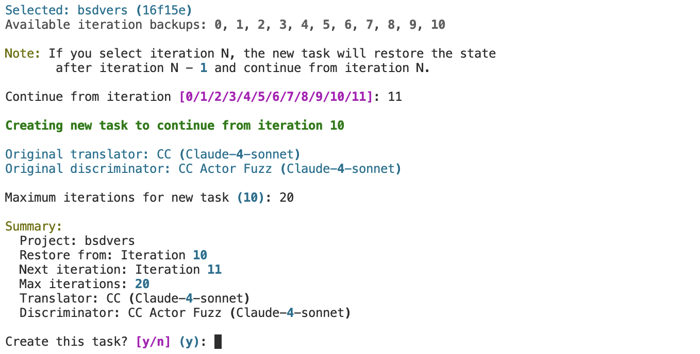

# Advanced Control of Translation Tasks
Besides the basic task creation, we also provide additional control for the translation process. The advanced controls include `stop`, `continue`, and `fork` for translation tasks.

The purpose of `stop` and `continue` is clear: sometimes you unavoidably need to stop a task due to errors, running out of tokens, discovering out-of-control mistakes in the translated code, etc. After addressing the issues, you want to continue the task. You may also want to extend a completed task to more iterations. The `continue` command will help in such cases.

## Stop Command
When using the `stop` command, you need to either indicate which task you want to stop (by using the index in the leftmost column of the status table, not the ID), or use `stopall` which stops all the tasks. Note that in the current version, the `stop` command **won't stop the ongoing translation/discrimination process**; it only waits until the current iteration finishes, then stops the task at the end of that iteration.

## Continue Command
The `continue` command is similar to `add`. After typing `continue`, you will see the following UI:

This table shows all the existing tasks no matter they are in "running", "stopped", "completed" or "error" status. You need to select the task you want to continue using the leftmost index. After selecting the task, you will see the following UI:

You need to follow the requirements to fill in the start point and new iteration number. As an example, the three numbers `10`, `11`, `20` in the "Summary" part of the above figure intuitively mean that: the task you selected has completed 10 iterations; now, as you requested, it will start the new iteration which is iter 11, and will run another 10 iterations until iter 20.

Note that if you do not continue the task from the latest iteration, the iterations after the start point will be overwritten. For instance, if a task has already completed 10 iterations and you choose to continue from iter 5, then iterations 5, 6, 7, 8, 9, 10 will be overwritten. Also, please do not continue a task that is in "running" status to avoid unexpected behavior. If you want to rerun several iterations without destroying the existing results, please use `fork`.

## Fork Command
The `fork` command is useful if you want to rerun several iterations without overwriting the existing results, or if you want to run a project from the same first few iterations and then compare different methods on later iterations. The usage is similar to the `continue` command, but `fork` will create a task **with a new instance ID** (which means it will have its own standalone storage and not overwrite the task being forked), and allows you to adjust the translator/discriminator settings.
